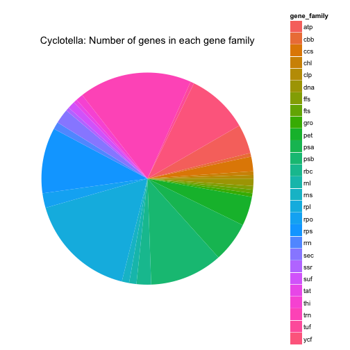
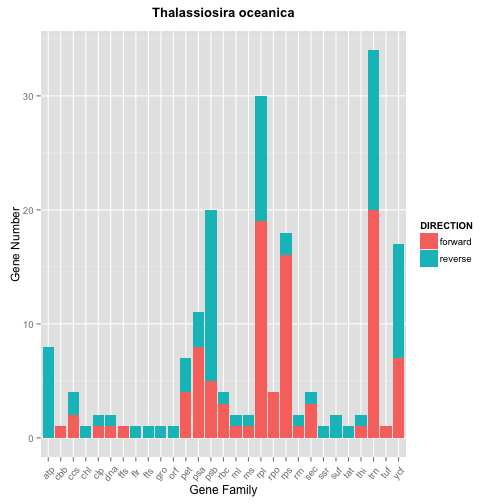

## DV_RProject3
========================================================
#### Group member: Anna Mengjie Yu (my3852),  Duy Vu (dhv242),  Syed Naqvi (san724)

With the advent of next generation sequencing, the sequencing cost per genome is decreasing significantly. Gene content and gene order has been useful in studying species evolution and ecological adaptation. Good data visualization tools will help community better understand the evolution story underneath the data. In this project, we will be using diatom plastid genome data from several diatom species. Each species may or may not share the same gene content due to environment selection. Difference tables can be joined by the gene names.

The tables contain plastid genome gene content, gene length and gene order, and they are accessible from Supporting Information in Yu's publicaiton. [http://journals.plos.org/plosone/article?id=10.1371/journal.pone.0107854]

*********
Load packages


```r
source("../01 Data/loadPackage.R", echo = TRUE)
```

```
## 
## > require("ggplot2")
```

```
## Loading required package: ggplot2
```

```
## 
## > require("gplots")
```

```
## Loading required package: gplots
## 
## Attaching package: 'gplots'
## 
## The following object is masked from 'package:stats':
## 
##     lowess
```

```
## 
## > require("grid")
```

```
## Loading required package: grid
```

```
## 
## > require("RCurl")
```

```
## Loading required package: RCurl
## Loading required package: bitops
```

```
## 
## > require("reshape2")
```

```
## Loading required package: reshape2
```

```
## 
## > require("tidyr")
```

```
## Loading required package: tidyr
```

```
## 
## > require("dplyr")
```

```
## Loading required package: dplyr
## 
## Attaching package: 'dplyr'
## 
## The following object is masked from 'package:stats':
## 
##     filter
## 
## The following objects are masked from 'package:base':
## 
##     intersect, setdiff, setequal, union
```

```
## 
## > require("jsonlite")
```

```
## Loading required package: jsonlite
## 
## Attaching package: 'jsonlite'
## 
## The following object is masked from 'package:utils':
## 
##     View
```

*********
First, we displayed a few lines of the dataset stored in oracle database. The table includes Name(gene name), MINIMUM (gene start position), MAXIMUM(gene end position), LENGTH(gene length), DIRECTION(sense and anti-sense strand).

**Table 1: Cyclotella**

```r
source("../01 Data/cyclotella.R", echo = TRUE)
```

```
## 
## > cyclotella <- data.frame(eval(parse(text = substring(getURL(URLencode("http://129.152.144.84:5001/rest/native/?query=\"select * from cyclotella\""), .... [TRUNCATED] 
## 
## > cyclotella %>% tbl_df
## Source: local data frame [180 x 5]
## 
##              NAME MINIMUM MAXIMUM LENGTH DIRECTION
## 1       psaA gene     103   2,361  2,259   forward
## 2       psaB gene   2,478   4,679  2,202   forward
## 3       petF gene   4,912   5,244    333   reverse
## 4      rpl20 gene   5,425   5,844    420   reverse
## 5      rpl35 gene   5,854   6,048    195   reverse
## 6      ycf42 gene   6,055   6,690    636   reverse
## 7       psaE gene   6,792   6,989    198   reverse
## 8  trnR(ucu) gene   7,154   7,226     73   reverse
## 9  trnV(uac) gene   7,237   7,308     72   reverse
## 10      psbH gene   7,575   7,775    201   reverse
## ..            ...     ...     ...    ...       ...
```

*********
**Table 2: Thalassiosira weissflogii**
Thalassiosira weissflogii is a closely related species to Cyclotella. They both belong to the same Thalassiosirales family.


```r
source("../01 Data/weiss.R", echo = TRUE)
```

```
## 
## > weiss <- data.frame(fromJSON(getURL(URLencode("129.152.144.84:5001/rest/native/?query=\"select * from weiss\""), 
## +     httpheader = c(DB = "jdbc:or ..." ... [TRUNCATED] 
## 
## > weiss %>% tbl_df
## Source: local data frame [180 x 5]
## 
##              NAME MINIMUM MAXIMUM LENGTH DIRECTION
## 1      rpl32 gene 120,353 120,517    165   reverse
## 2       psbY gene 120,762 120,872    111   reverse
## 3       rrn5 rRNA 121,057 121,182    126   reverse
## 4             rns 121,332 124,090  2,759   reverse
## 5   trnA-UGC gene 124,179 124,251     73   reverse
## 6   trnI-GAU gene 124,254 124,327     74   reverse
## 7             rnl 124,384 125,860  1,477   reverse
## 8      ycf89 gene 126,149 127,111    963   reverse
## 9  trnP(ugg) gene 127,458 127,531     74   forward
## 10      psaA gene     142   2,400  2,259   forward
## ..            ...     ...     ...    ...       ...
```

*********
**Table 3: Cerataulina daemon**
Cerataulina daemon is more closely related to Chaetoros simplex than the two Thalassiosirales.

```r
source("../01 Data/cerataulina.R", echo = TRUE)
```

```
## 
## > cera <- data.frame(fromJSON(getURL(URLencode("129.152.144.84:5001/rest/native/?query=\"select * from cerataulina\""), 
## +     httpheader = c(DB = "jd ..." ... [TRUNCATED] 
## 
## > cera %>% tbl_df
## Source: local data frame [169 x 5]
## 
##             NAME MINIMUM MAXIMUM LENGTH DIRECTION
## 1      psaA gene     362   2,620  2,259   forward
## 2      psaB gene   2,712   4,913  2,202   forward
## 3  trnD-GUC gene   5,037   5,110     74   reverse
## 4  trnS-GCU gene   5,175   5,260     86   reverse
## 5  trnI-CAU gene   5,298   5,369     72   reverse
## 6     ycf33 gene   5,546   5,740    195   forward
## 7  trnY-GUA gene   7,698   7,780     83   reverse
## 8  trnV-UAC gene   8,306   8,371     66   forward
## 9  trnR-UCU gene   8,383   8,455     73   forward
## 10     trnT(ugu)   8,768   8,839     72   reverse
## ..           ...     ...     ...    ...       ...
```

*********
**Table 4: Chaetoceros simplex**

```r
source("../01 Data/chaetoceros.R", echo = TRUE)
```

```
## 
## > chaeto <- data.frame(fromJSON(getURL(URLencode("129.152.144.84:5001/rest/native/?query=\"select * from chaetoceros\""), 
## +     httpheader = c(DB = " ..." ... [TRUNCATED] 
## 
## > chaeto %>% tbl_df
## Source: local data frame [169 x 5]
## 
##              NAME MINIMUM MAXIMUM LENGTH DIRECTION
## 1      ycf45 gene       2   1,168  1,167   reverse
## 2       petD gene   1,330   1,812    483   reverse
## 3       petB gene   1,865   2,512    648   reverse
## 4   trnS-UGA gene   2,571   2,657     87   reverse
## 5       psaD gene   2,690   3,109    420   reverse
## 6  trnfM-CAU gene   3,195   3,266     72   reverse
## 7       rps2 gene   3,388   4,071    684   reverse
## 8      rpoC2 gene   4,159   8,406  4,248   reverse
## 9      rpoC1 gene   8,435  10,840  2,406   reverse
## 10      rpoB gene  10,858  15,099  4,242   reverse
## ..            ...     ...     ...    ...       ...
```

*********

**Table 5: Thalassiosira oceanica**

```r
source("../01 Data/ocean.R", echo = TRUE)
```

```
## 
## > ocean <- data.frame(fromJSON(getURL(URLencode("129.152.144.84:5001/rest/native/?query=\"select * from ocean\""), 
## +     httpheader = c(DB = "jdbc:or ..." ... [TRUNCATED]
```

*********
 Data Wrangling 1
 
 1.For each original table, create new column gene_family by extracting the first three charaters from gene NAME, and further group by gene family.

```r
source("../02 Data Wrangling/geneFamily.R", echo = TRUE)
```

```
## 
## > cyc_gf <- cyclotella %>% mutate(gene_family = substr(NAME, 
## +     1, 3)) %>% group_by(gene_family)
## 
## > cyc_gf %>% tbl_df
## Source: local data frame [180 x 6]
## 
##              NAME MINIMUM MAXIMUM LENGTH DIRECTION gene_family
## 1       psaA gene     103   2,361  2,259   forward         psa
## 2       psaB gene   2,478   4,679  2,202   forward         psa
## 3       petF gene   4,912   5,244    333   reverse         pet
## 4      rpl20 gene   5,425   5,844    420   reverse         rpl
## 5      rpl35 gene   5,854   6,048    195   reverse         rpl
## 6      ycf42 gene   6,055   6,690    636   reverse         ycf
## 7       psaE gene   6,792   6,989    198   reverse         psa
## 8  trnR(ucu) gene   7,154   7,226     73   reverse         trn
## 9  trnV(uac) gene   7,237   7,308     72   reverse         trn
## 10      psbH gene   7,575   7,775    201   reverse         psb
## ..            ...     ...     ...    ...       ...         ...
## 
## > weiss_gf <- weiss %>% mutate(gene_family = substr(NAME, 
## +     1, 3)) %>% group_by(gene_family)
## 
## > weiss_gf %>% tbl_df
## Source: local data frame [180 x 6]
## 
##              NAME MINIMUM MAXIMUM LENGTH DIRECTION gene_family
## 1      rpl32 gene 120,353 120,517    165   reverse         rpl
## 2       psbY gene 120,762 120,872    111   reverse         psb
## 3       rrn5 rRNA 121,057 121,182    126   reverse         rrn
## 4             rns 121,332 124,090  2,759   reverse         rns
## 5   trnA-UGC gene 124,179 124,251     73   reverse         trn
## 6   trnI-GAU gene 124,254 124,327     74   reverse         trn
## 7             rnl 124,384 125,860  1,477   reverse         rnl
## 8      ycf89 gene 126,149 127,111    963   reverse         ycf
## 9  trnP(ugg) gene 127,458 127,531     74   forward         trn
## 10      psaA gene     142   2,400  2,259   forward         psa
## ..            ...     ...     ...    ...       ...         ...
## 
## > cera_gf <- cera %>% mutate(gene_family = substr(NAME, 
## +     1, 3)) %>% group_by(gene_family)
## 
## > cera_gf %>% tbl_df
## Source: local data frame [169 x 6]
## 
##             NAME MINIMUM MAXIMUM LENGTH DIRECTION gene_family
## 1      psaA gene     362   2,620  2,259   forward         psa
## 2      psaB gene   2,712   4,913  2,202   forward         psa
## 3  trnD-GUC gene   5,037   5,110     74   reverse         trn
## 4  trnS-GCU gene   5,175   5,260     86   reverse         trn
## 5  trnI-CAU gene   5,298   5,369     72   reverse         trn
## 6     ycf33 gene   5,546   5,740    195   forward         ycf
## 7  trnY-GUA gene   7,698   7,780     83   reverse         trn
## 8  trnV-UAC gene   8,306   8,371     66   forward         trn
## 9  trnR-UCU gene   8,383   8,455     73   forward         trn
## 10     trnT(ugu)   8,768   8,839     72   reverse         trn
## ..           ...     ...     ...    ...       ...         ...
## 
## > chaeto_gf <- chaeto %>% mutate(gene_family = substr(NAME, 
## +     1, 3)) %>% group_by(gene_family)
## 
## > chaeto_gf %>% tbl_df
## Source: local data frame [169 x 6]
## 
##              NAME MINIMUM MAXIMUM LENGTH DIRECTION gene_family
## 1      ycf45 gene       2   1,168  1,167   reverse         ycf
## 2       petD gene   1,330   1,812    483   reverse         pet
## 3       petB gene   1,865   2,512    648   reverse         pet
## 4   trnS-UGA gene   2,571   2,657     87   reverse         trn
## 5       psaD gene   2,690   3,109    420   reverse         psa
## 6  trnfM-CAU gene   3,195   3,266     72   reverse         trn
## 7       rps2 gene   3,388   4,071    684   reverse         rps
## 8      rpoC2 gene   4,159   8,406  4,248   reverse         rpo
## 9      rpoC1 gene   8,435  10,840  2,406   reverse         rpo
## 10      rpoB gene  10,858  15,099  4,242   reverse         rpo
## ..            ...     ...     ...    ...       ...         ...
```
 *********
 Data Wrangling 2
 
 

```r
source("../02 Data Wrangling/cyc_FR.R", echo = TRUE)
```

```
## 
## > cyc_gf_forward <- filter(cyc_gf, DIRECTION == "forward")
## 
## > cyc_gf_forward %>% tbl_df
## Source: local data frame [107 x 6]
## 
##              NAME MINIMUM MAXIMUM LENGTH DIRECTION gene_family
## 1       psaA gene     103   2,361  2,259   forward         psa
## 2       psaB gene   2,478   4,679  2,202   forward         psa
## 3       psbN gene   7,860   7,991    132   forward         psb
## 4       rbcL gene  16,918  18,390  1,473   forward         rbc
## 5       rbcS gene  18,429  18,848    420   forward         rbc
## 6       psbX gene  19,138  19,254    117   forward         psb
## 7      ycf66 gene  19,444  19,752    309   forward         ycf
## 8       psbV gene  19,806  20,297    492   forward         psb
## 9  trnR(ccg) gene  20,396  20,467     72   forward         trn
## 10      ssra gene  20,522  20,868    347   forward         ssr
## ..            ...     ...     ...    ...       ...         ...
## 
## > cyc_gf_forwardNum <- cyc_gf_forward %>% group_by(gene_family) %>% 
## +     summarise(forward_gene_num = n())
## 
## > cyc_gf_forwardNum
## Source: local data frame [22 x 2]
## 
##    gene_family forward_gene_num
## 1          atp                2
## 2          cbb                1
## 3          ccs                2
## 4          clp                1
## 5          gro                1
## 6          pet                5
## 7          psa                8
## 8          psb                9
## 9          rbc                3
## 10         rnl                1
## ..         ...              ...
## 
## > cyc_gf_reverse <- filter(cyc_gf, DIRECTION == "reverse")
## 
## > cyc_gf_reverse %>% tbl_df
## Source: local data frame [73 x 6]
## 
##              NAME MINIMUM MAXIMUM LENGTH DIRECTION gene_family
## 1       petF gene   4,912   5,244    333   reverse         pet
## 2      rpl20 gene   5,425   5,844    420   reverse         rpl
## 3      rpl35 gene   5,854   6,048    195   reverse         rpl
## 4      ycf42 gene   6,055   6,690    636   reverse         ycf
## 5       psaE gene   6,792   6,989    198   reverse         psa
## 6  trnR(ucu) gene   7,154   7,226     73   reverse         trn
## 7  trnV(uac) gene   7,237   7,308     72   reverse         trn
## 8       psbH gene   7,575   7,775    201   reverse         psb
## 9       psbT gene   8,016   8,114     99   reverse         psb
## 10      psbB gene   8,165   9,694  1,530   reverse         psb
## ..            ...     ...     ...    ...       ...         ...
## 
## > cyc_gf_reverseNum <- cyc_gf_reverse %>% group_by(gene_family) %>% 
## +     summarise(reverse_gene_num = n())
## 
## > cyc_gf_reverseNum
## Source: local data frame [21 x 2]
## 
##    gene_family reverse_gene_num
## 1          atp                6
## 2          ccs                2
## 3          chl                1
## 4          dna                2
## 5          ffs                1
## 6          fts                1
## 7          pet                3
## 8          psa                3
## 9          psb               11
## 10         rbc                1
## ..         ...              ...
## 
## > cyc_gf_num <- cyc_gf %>% group_by(gene_family) %>% 
## +     summarise(total_gene_num = n())
```

*********
 Data Wrangling 3
 
blalalala

```r
#source("../02 Data Wrangling/geneFamily.R", echo = TRUE)
```
 
 *********
 **Figure 1: Comparison of number of genes in different species**

```r
source("../02 Data Wrangling/geneFamily.R", echo = TRUE)
```

```
## 
## > cyc_gf <- cyclotella %>% mutate(gene_family = substr(NAME, 
## +     1, 3)) %>% group_by(gene_family)
## 
## > cyc_gf %>% tbl_df
## Source: local data frame [180 x 6]
## 
##              NAME MINIMUM MAXIMUM LENGTH DIRECTION gene_family
## 1       psaA gene     103   2,361  2,259   forward         psa
## 2       psaB gene   2,478   4,679  2,202   forward         psa
## 3       petF gene   4,912   5,244    333   reverse         pet
## 4      rpl20 gene   5,425   5,844    420   reverse         rpl
## 5      rpl35 gene   5,854   6,048    195   reverse         rpl
## 6      ycf42 gene   6,055   6,690    636   reverse         ycf
## 7       psaE gene   6,792   6,989    198   reverse         psa
## 8  trnR(ucu) gene   7,154   7,226     73   reverse         trn
## 9  trnV(uac) gene   7,237   7,308     72   reverse         trn
## 10      psbH gene   7,575   7,775    201   reverse         psb
## ..            ...     ...     ...    ...       ...         ...
## 
## > weiss_gf <- weiss %>% mutate(gene_family = substr(NAME, 
## +     1, 3)) %>% group_by(gene_family)
## 
## > weiss_gf %>% tbl_df
## Source: local data frame [180 x 6]
## 
##              NAME MINIMUM MAXIMUM LENGTH DIRECTION gene_family
## 1      rpl32 gene 120,353 120,517    165   reverse         rpl
## 2       psbY gene 120,762 120,872    111   reverse         psb
## 3       rrn5 rRNA 121,057 121,182    126   reverse         rrn
## 4             rns 121,332 124,090  2,759   reverse         rns
## 5   trnA-UGC gene 124,179 124,251     73   reverse         trn
## 6   trnI-GAU gene 124,254 124,327     74   reverse         trn
## 7             rnl 124,384 125,860  1,477   reverse         rnl
## 8      ycf89 gene 126,149 127,111    963   reverse         ycf
## 9  trnP(ugg) gene 127,458 127,531     74   forward         trn
## 10      psaA gene     142   2,400  2,259   forward         psa
## ..            ...     ...     ...    ...       ...         ...
## 
## > cera_gf <- cera %>% mutate(gene_family = substr(NAME, 
## +     1, 3)) %>% group_by(gene_family)
## 
## > cera_gf %>% tbl_df
## Source: local data frame [169 x 6]
## 
##             NAME MINIMUM MAXIMUM LENGTH DIRECTION gene_family
## 1      psaA gene     362   2,620  2,259   forward         psa
## 2      psaB gene   2,712   4,913  2,202   forward         psa
## 3  trnD-GUC gene   5,037   5,110     74   reverse         trn
## 4  trnS-GCU gene   5,175   5,260     86   reverse         trn
## 5  trnI-CAU gene   5,298   5,369     72   reverse         trn
## 6     ycf33 gene   5,546   5,740    195   forward         ycf
## 7  trnY-GUA gene   7,698   7,780     83   reverse         trn
## 8  trnV-UAC gene   8,306   8,371     66   forward         trn
## 9  trnR-UCU gene   8,383   8,455     73   forward         trn
## 10     trnT(ugu)   8,768   8,839     72   reverse         trn
## ..           ...     ...     ...    ...       ...         ...
## 
## > chaeto_gf <- chaeto %>% mutate(gene_family = substr(NAME, 
## +     1, 3)) %>% group_by(gene_family)
## 
## > chaeto_gf %>% tbl_df
## Source: local data frame [169 x 6]
## 
##              NAME MINIMUM MAXIMUM LENGTH DIRECTION gene_family
## 1      ycf45 gene       2   1,168  1,167   reverse         ycf
## 2       petD gene   1,330   1,812    483   reverse         pet
## 3       petB gene   1,865   2,512    648   reverse         pet
## 4   trnS-UGA gene   2,571   2,657     87   reverse         trn
## 5       psaD gene   2,690   3,109    420   reverse         psa
## 6  trnfM-CAU gene   3,195   3,266     72   reverse         trn
## 7       rps2 gene   3,388   4,071    684   reverse         rps
## 8      rpoC2 gene   4,159   8,406  4,248   reverse         rpo
## 9      rpoC1 gene   8,435  10,840  2,406   reverse         rpo
## 10      rpoB gene  10,858  15,099  4,242   reverse         rpo
## ..            ...     ...     ...    ...       ...         ...
```

```r
source("../03 Visualizations/R3_figure1.R", echo = TRUE)
```

 

```
## 
## > l_gf <- list()
## 
## > l_gf[[1]] <- ggplot(data = cyc_gf, mapping = aes(x = gene_family)) + 
## +     layer(geom = "bar", mapping = aes(fill = DIRECTION)) + labs(title = "Cyc ..." ... [TRUNCATED] 
## 
## > l_gf[[2]] <- ggplot(data = weiss_gf, mapping = aes(x = gene_family)) + 
## +     layer(geom = "bar", mapping = aes(fill = DIRECTION)) + labs(title = "T ..." ... [TRUNCATED] 
## 
## > l_gf[[3]] <- ggplot(data = cera_gf, mapping = aes(x = gene_family)) + 
## +     layer(geom = "bar", mapping = aes(fill = DIRECTION)) + labs(title = "Ce ..." ... [TRUNCATED] 
## 
## > l_gf[[4]] <- ggplot(data = chaeto_gf, mapping = aes(x = gene_family)) + 
## +     layer(geom = "bar", mapping = aes(fill = DIRECTION)) + labs(title = " ..." ... [TRUNCATED] 
## 
## > pushViewport(viewport(layout = grid.layout(2, 4)))
## 
## > print(l_gf[[1]], vp = viewport(layout.pos.row = 1, 
## +     layout.pos.col = 1:2))
## 
## > print(l_gf[[2]], vp = viewport(layout.pos.row = 1, 
## +     layout.pos.col = 3:4))
## 
## > print(l_gf[[3]], vp = viewport(layout.pos.row = 2, 
## +     layout.pos.col = 1:2))
## 
## > print(l_gf[[4]], vp = viewport(layout.pos.row = 2, 
## +     layout.pos.col = 3:4))
```
In this figure, the x axis indicates gene family, the y axis indicates gene number in that family. The red color indicates genes in forward direction (sense strand), and the blue color indicates genes in reverse direction (anti-sense strand).

From this figure, we can see that Cyclotella and Thalassiosira weissflogii has similar number of forward and reverse genes in each gene family, while Cerataulina and Chaetoceros showing different number of forward and reverse genes in each gene family. 

*********
**Figure 2: Comparison of number of genes in each gene family in forward and reverse direction**
The number of genes in each gene family, using Cyclotella as an example.

```r
source("../03 Visualizations/cyc_total_pie.R", echo = TRUE)
```

```
## 
## > cyc_total_pie <- ggplot(cyc_gf_num, aes(x = " ", y = total_gene_num, 
## +     fill = gene_family)) + geom_bar(width = 1, stat = "identity") + 
## +     c .... [TRUNCATED] 
## 
## > print(cyc_total_pie)
```

 

The number of forward genes in each gene family, and the number of reverse genes in each gene family.


```r
source("../03 Visualizations/pie_fr.R", echo = TRUE)
```

 

```
## 
## > l_cyc_fr <- list()
## 
## > l_cyc_fr[[1]] <- ggplot(cyc_gf_forwardNum, aes(x = " ", 
## +     y = forward_gene_num, fill = gene_family)) + geom_bar(width = 1, 
## +     stat = "ident ..." ... [TRUNCATED] 
## 
## > l_cyc_fr[[2]] <- ggplot(cyc_gf_reverseNum, aes(x = " ", 
## +     y = reverse_gene_num, fill = gene_family)) + geom_bar(width = 1, 
## +     stat = "ident ..." ... [TRUNCATED] 
## 
## > l_cyc_fr[[3]] <- ggplot(cyc_gf_num, aes(x = " ", y = total_gene_num, 
## +     fill = gene_family)) + geom_bar(width = 1, stat = "identity") + 
## +     c .... [TRUNCATED] 
## 
## > pushViewport(viewport(layout = grid.layout(1, 4)))
## 
## > print(l_cyc_fr[[1]], vp = viewport(layout.pos.row = 1, 
## +     layout.pos.col = 1:2))
## 
## > print(l_cyc_fr[[2]], vp = viewport(layout.pos.row = 1, 
## +     layout.pos.col = 3:4))
```

*********
**Figure 3:fdafdafd**

*********
**Figure 4: Histogram from non-categorical data**

```r
source("../01 Data/categorical.R", echo = TRUE)
```

```
## 
## > categoricals <- eval(parse(text = substring(getURL(URLencode("http://129.152.144.84:5001/rest/native/?query=\"select * from ocean\""), 
## +     httphe .... [TRUNCATED] 
## 
## > categoricals
## [[1]]
## [[1]][[1]]
## [1] "NAME"
## 
## [[1]][[2]]
## [1] "DIRECTION"
## 
## 
## [[2]]
## [[2]][[1]]
## [1] "START_POS"
## 
## [[2]][[2]]
## [1] "END_POS"
## 
## [[2]][[3]]
## [1] "LENGTH"
```

```r
source("../03 Visualizations/histogram.R", echo = TRUE)
```

```
## 
## > myplot1 <- function(df, x) {
## +     names(df) <- c("x")
## +     ggplot(df, aes(x = x)) + geom_histogram()
## + }
## 
## > l_hist <- list()
## 
## > for (i in names(ocean)) {
## +     if (i %in% categoricals[[2]]) {
## +         r <- data.frame(fromJSON(getURL(URLencode("129.152.144.84:5001/rest/native ..." ... [TRUNCATED] 
## 
## > startFig <- l_hist[[1]] + ggtitle("Codon Start Position") + 
## +     geom_histogram(aes(fill = ..count..)) + theme(legend.position = "none", 
## +     ax .... [TRUNCATED] 
## 
## > print(startFig)
```

```
## stat_bin: binwidth defaulted to range/30. Use 'binwidth = x' to adjust this.
## stat_bin: binwidth defaulted to range/30. Use 'binwidth = x' to adjust this.
```

```
## 
## > endFig <- l_hist[[2]] + ggtitle("Codon End Position") + 
## +     geom_histogram(aes(fill = ..count..)) + theme(legend.position = "none", 
## +     axis.t .... [TRUNCATED] 
## 
## > lenFig <- l_hist[[3]] + ggtitle("Gene Length") + geom_histogram(aes(fill = ..count..)) + 
## +     theme(axis.text.x = element_text(angle = 50, vjust = .... [TRUNCATED] 
## 
## > pushViewport(viewport(layout = grid.layout(3, 4)))
## 
## > print(startFig, vp = viewport(layout.pos.row = 1, 
## +     layout.pos.col = 1:2))
```

```
## stat_bin: binwidth defaulted to range/30. Use 'binwidth = x' to adjust this.
## stat_bin: binwidth defaulted to range/30. Use 'binwidth = x' to adjust this.
```

```
## 
## > print(endFig, vp = viewport(layout.pos.row = 1, layout.pos.col = 3:4))
```

```
## stat_bin: binwidth defaulted to range/30. Use 'binwidth = x' to adjust this.
## stat_bin: binwidth defaulted to range/30. Use 'binwidth = x' to adjust this.
```

```
## 
## > print(lenFig, vp = viewport(layout.pos.row = 2:3, 
## +     layout.pos.col = 1:4))
```

```
## stat_bin: binwidth defaulted to range/30. Use 'binwidth = x' to adjust this.
## stat_bin: binwidth defaulted to range/30. Use 'binwidth = x' to adjust this.
```

 

